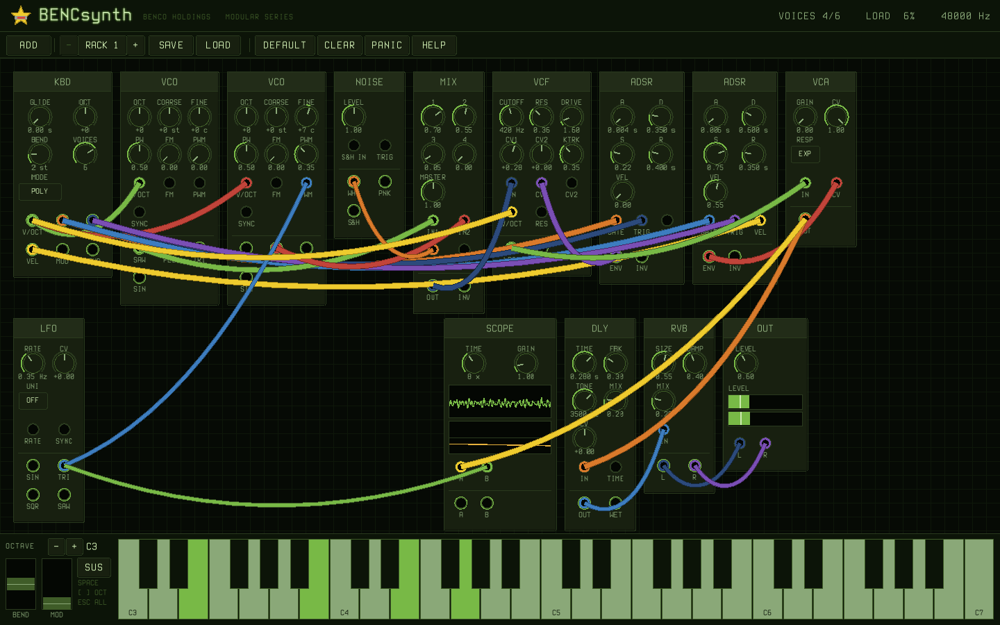
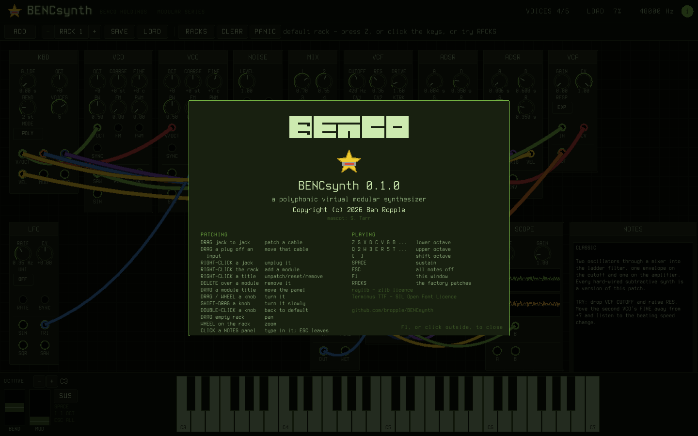
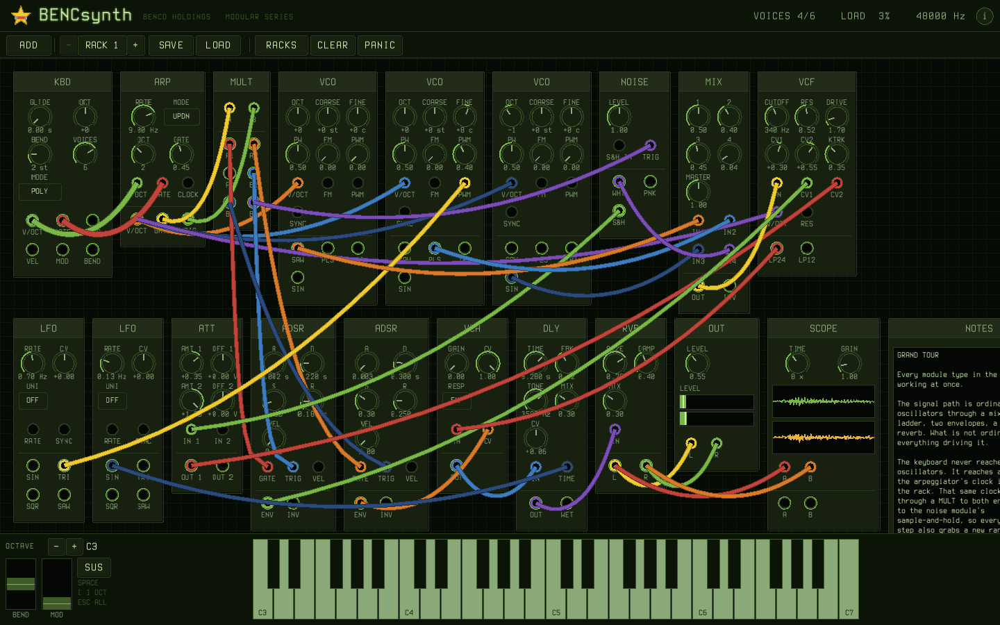
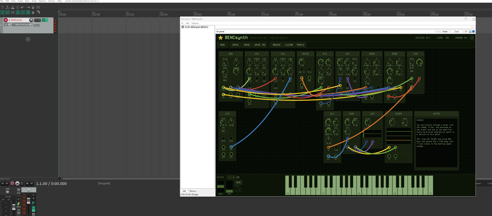

<p align="center">
  
</p>

# BENCsynth

[](https://github.com/bropple/BENCsynth/actions/workflows/ci.yml)
[](LICENSE)

A polyphonic virtual modular synthesizer. Panels in a rack, jacks you drag
patch cables between, and the cables hang.



**[Download a build](https://github.com/bropple/BENCsynth/releases/latest)** for
Linux, macOS or Windows — or `make` it. Every push also builds all three and
keeps them: the
[latest run](https://github.com/bropple/BENCsynth/actions/workflows/ci.yml)
has a `.tar.gz`, a `.dmg` and a `.zip` attached.

**[Hear it](docs/bencsynth-demo.wav)** — a phrase through the default rack,
rendered offline by `make render`, which needs neither a window nor a sound
card.

Fourteen module types, eight-voice polyphony carried in the cables themselves,
a Moog-style ladder filter, and a keyboard along the bottom you can play with
the mouse or with the computer keyboard.

The mascot is **S. Tarr**, who is the program's icon, sits in the header, and
otherwise stays out of the way.

<p align="center">
  
</p>

---

## Building

```
make            # the synthesizer
make test       # the core tests - no raylib, no sound card needed
make render     # a phrase through the default rack, written to a .wav
make lv2        # the LV2 plugin, for LMMS and every other LV2 host
make lv2-test   # load the plugin in a tiny host and play it
make icons      # regenerate assets/icon from the star geometry in the code
make info       # what the build decided about raylib
```

raylib 5.5 is the only dependency, and the build looks for it in three places,
most specific first:

| Where | How |
|---|---|
| `vendor/raylib/` | drop a prefix in the tree with `include/` and `lib/` |
| `RAYLIB=/prefix` | `RAYLIB=/opt/raylib make` |
| pkg-config | a system package |

`vendor/` is gitignored, so a fresh clone has to supply one of the three.
Building raylib from source into `vendor/raylib` is the path with the fewest
surprises:

```
git clone --depth 1 https://github.com/raysan5/raylib
cmake -S raylib -B raylib/build -DCMAKE_INSTALL_PREFIX=$PWD/vendor/raylib \
      -DBUILD_EXAMPLES=OFF -DBUILD_SHARED_LIBS=OFF
cmake --build raylib/build --target install -j
```

`make test`, `make core` and `make render` need none of it — the DSP core does
not link raylib, deliberately.

---

## Playing it

The window opens on a complete subtractive voice: two oscillators through a
mixer into the ladder filter, one envelope on the cutoff and one on the
amplifier, then a delay and a reverb into the output stage.

**Keyboard**

| | |
|---|---|
| `Z S X D C V G B H N J M` | the lower octave |
| `Q 2 W 3 E R 5 T 6 Y 7 U` | the octave above it |
| `[` `]` | shift octave |
| `SPACE` | sustain |
| `ESC` | all notes off |
| `F1`, or the `i` in the corner | what everything does |

Clicking the on-screen keys works too, and dragging across them glides. How
far down a key you click sets the velocity.

**Patching**

| | |
|---|---|
| drag jack → jack | patch a cable |
| drag a plug out of an input | pick that cable up and move it |
| right-click a jack | unplug it |
| right-click the rack | add a module |
| right-click a module title | unpatch / reset knobs / remove |
| `DELETE` over a module | remove it |
| drag a module title | move the panel |
| drag, or wheel, on a knob | turn it |
| shift-drag a knob | turn it slowly |
| double-click a knob | back to its default |
| drag empty rack, or middle-drag | pan |
| wheel on the rack | zoom, toward the pointer |
| shift-wheel | scroll sideways |

Outputs fan out to as many inputs as you like; an input takes one cable, and a
second one replaces the first. Patching backwards — from an input, looking for
a source — works as well.

`OPEN`, `SAVE` and `SAVE AS` work on named `.bencsynth` files through the
system's own file dialog — `Ctrl-O`, `Ctrl-S`, `Ctrl-Shift-S`. The window title
shows which rack is loaded. `./bencsynth some-rack.bencsynth` opens one
directly.

On a Linux box with neither `zenity` nor `kdialog` installed there is no dialog
to ask with, so `SAVE` writes to `patches/rack.bencsynth` beside the program
and says so, rather than refusing.

---

## The factory racks

`RACKS` in the toolbar replaces everything with one of twenty-seven worked
examples. Every one has a SCOPE across its output so you can see the waveform,
and a NOTES panel saying what it is doing and which knob to turn.
A modular's problem is not that it cannot make a sound, it is that it makes no
sound until you already know what you are doing — and the fastest way to learn
what resonance does is to be handed a rack where it is already doing something
and turn the knob.

| | |
|---|---|
| **CLASSIC** | two oscillators, ladder, delay and reverb — what the window opens on |
| **INIT** | one oscillator, one envelope, one amplifier. A place to start building |
| **BASS** | legato mono, a sine an octave down under the saw, short filter thump |
| **SQUARE LEAD** | pulse width on an LFO, glide and echo |
| **SAW PAD** | eight voices, two saws pulled a few cents apart, long reverb |
| **PLUCK** | no sustain on either envelope, resonant filter chirp |
| **DRONE** | the filter is past self-oscillation, so it *is* the oscillator. Makes sound with nothing held down; turn RES down and it stops |
| **WIND** | noise through a resonant filter and no oscillator anywhere, played from the keyboard |

And six off the dance floor, which are recognisable sounds rather than
categories — a rack you can hum is a rack you can take apart to find out why:

| | |
|---|---|
| **SUPERSAW** | three saws a few cents apart. The beating between them *is* the sound — zero the FINE knobs and it collapses to one thin oscillator |
| **ACID** | a 303 in the parts that matter: one saw, glide between overlapping notes, and resonance high enough that the filter envelope is the melody |
| **HOOVER** | the rave stab. A saw and a pulse detuned a third of a semitone apart, pulse width swept underneath |
| **REESE** | two saws a hair apart, mono and low. Only works in mono — eight voices of it is mud |
| **TRANCE GATE** | a pad behind a second VCA that a square LFO opens sixteen times a bar. Hold a chord and the rhythm is the LFO's; turn its RATE and the tempo changes |
| **ORGAN STAB** | house chord stab, a pulse with a saw an octave above |

And twelve that each exist to show one trick — an oscillator used as a
modulator, a filter inside a delay's feedback path, an amplifier with its gain
allowed to go negative. They are instruments, but they are also the shortest
answer to *what else is this thing for*:

| | |
|---|---|
| **CHORD** | three oscillators a third and a fifth apart, so one key is a chord. Retune COARSE to +3 and +7 and the whole rack turns minor |
| **OCTAVES** | four oscillators an octave apart, mixed like drawbars. The mixer levels are the registration — additive synthesis in a modular's clothes |
| **HARD SYNC** | one oscillator restarting another. The slave's pitch is swept but it can never finish a cycle, so what changes is the shape of each period, not the note |
| **RING MOD** | a VCA in its four-quadrant mode, driven at audio rate. Out comes the sum and difference of two frequencies and neither original |
| **FM BELL** | one sine bending another's pitch, with an envelope on how much. Exponential rather than through-zero FM, so it lands nearer a gamelan than an electric piano |
| **SAMPLE HOLD** | plays itself. A square LFO clocks the sample-and-hold, an attenuverter squeezes the random voltage into an octave, and that is the pitch. Nothing is connected to the keyboard |
| **DUB SIREN** | a mixer used as a CV summer: keyboard pitch and an LFO added *before* the oscillator, because an input jack takes one cable |
| **WOBBLE** | the cutoff on a fast LFO with the resonance up. The same modulation TRANCE GATE puts on an amplifier, moved one module left |
| **PWM STRINGS** | two pulses on two LFOs at *close but unequal* rates, so they drift in and out of phase forever. That drift is the whole string-machine sound |
| **KICK** | an envelope on the pitch and no filter anywhere. Fifty milliseconds, three octaves down |
| **SNARE** | noise, a resonant filter and a very short envelope. Cutoff is the pitch of it — drop it for a tom, raise it for a hat |
| **HOWL** | a resonant filter inside a delay's feedback path. Plays itself; the loop only works because a cycle in the patch is read one block late |

And one for a certain 1984 chase scene:

| | |
|---|---|
| **AXEL** | a bright mono lead — a saw and a pulse five cents apart, resonance just high enough to whistle, and a slapback echo doing as much period work as the oscillators |

And one that is the answer to *what can this thing actually do*:



| | |
|---|---|
| **GRAND TOUR** | every module type in the set, patched into one instrument. The keyboard never reaches the oscillators — it reaches an ARP, and the arpeggiator's clock is what plays the rack. That same clock goes through a MULT to both envelopes *and* to the sample-and-hold, so every step also grabs a random voltage, which an ATT scales down and sends to the filter. A second LFO bends the delay's time, so the echoes wow like tape. |

`./bencsynth --rack PLUCK` opens straight into one, and
`./bencsynth-render out.wav PLUCK` renders a phrase through it without a window
or a sound card.

---

## The modules

| | |
|---|---|
| **KBD** | keyboard interface — pitch, gate, trigger, velocity, mod, bend. Glide, octave, bend range, voice count, poly/mono/legato. The only source of polyphony. |
| **VCO** | band-limited oscillator; saw, pulse, triangle and sine all at once, as a hardware VCO has them. Exponential FM, PWM, hard sync. |
| **LFO** | the same core, slow. Four shapes, rate CV, sync, unipolar switch. |
| **NOISE / S&H** | white and pink noise, and a sample-and-hold that samples its own noise when nothing is patched into it. |
| **VCF** | Moog ladder, four-pole, with a two-pole tap. Two attenuverted cutoff CVs, keyboard tracking, drive, resonance to past self-oscillation. |
| **VCA** | linear or exponential, with a CV depth. |
| **ADSR** | gate, retrigger and velocity in; envelope and its inverse out. |
| **MIX** | four in with levels, a master, and an inverted output. |
| **MULT** | two buffered multiples, one in to three out. |
| **ATT** | two attenuverters with offsets. |
| **DLY** | echo — time with CV, feedback, tone, mix. |
| **RVB** | a small room. Size, damping, mix, stereo out. |
| **MACRO** | eight knobs and eight jacks, 0–10 V out. A manual CV source standing in for the controls a plugin host will automate — see `docs/PLUGIN.md`. |
| **ARP** | takes a polyphonic pitch and gate, plays the held notes one at a time on an internal or external clock. Up / down / up-down / random / as-played, octave range, gate length. |
| **SCOPE** | two traces with a time base, so you can see what you patched. |
| **TEXT** | a scratchpad that does nothing to the audio. Somewhere to write down what a rack is for — which is the one thing a patch cannot tell you, since the cables say what is connected and nothing says why. Saves with the patch. |
| **OUT** | the output stage, with a peak-and-RMS meter. |

Voltages follow hardware convention throughout: audio at ±5 V, one volt per
octave with 0 V at middle C, gates at 10 V, envelopes 0–10 V. That is what
makes an attenuverter, an offset and a mixer behave the way the panel says
they will no matter what you plug into them.

---

## How the polyphony works

The patch is not duplicated per voice. A cable carries up to eight channels,
the KBD module decides how many, and every module downstream processes
whatever arrives — so one VCO panel really is eight oscillators when eight
keys are down. Polyphonic cables are drawn thicker than mono ones, which is
how you can see where the voices end and the mono tail begins.

---

## Layout

```
src/core/      the synthesizer. No raylib, no globals, no allocation in
               process(). This is what a plugin will link.
src/gui/       the window: theme, widgets, rack, cable physics, keyboard.
tests/         core tests
tools/         the offline renderer, and the icon and packaging scripts
assets/        the interface font, the BENCO wordmark, the S. Tarr icons
```

`make icons` regenerates `assets/icon` from `bs_star_image()` — the same code
that draws the mark in the window — so the icon in your taskbar cannot drift
from the one in the `.ico`. It needs ImageMagick; the results are committed, so
a build does not.

`ARCHITECTURE.md` goes into why it is arranged that way.

---

## As a plugin



The whole rack, inside a DAW. The CLAP opens the real editor — cables, physics,
keyboard — and the plugin plays what you patch. Notes from the host light up
the keyboard and drive the scopes; knob moves reach the audio without
rebuilding anything.

```
make clap-fetch && make clap-install     # CLAP - REAPER, Bitwig, rack and editor
make vst3-fetch  && make vst3-install    # VST3 - Ableton, Cubase, FL, Studio One
make lv2-install                         # LV2  - Ardour, Qtractor, LMMS 1.3
```

Both copy the plugin where hosts already look, so there is nothing to configure
in the host — restart it and it is there.

### Where they go

**CLAP** — a single `bencsynth.clap` file on Linux and Windows; a bundle
directory on macOS.

| | User | System |
|---|---|---|
| **Windows** | `%LOCALAPPDATA%\Programs\Common\CLAP` | `%COMMONPROGRAMFILES%\CLAP` |
| **Linux** | `~/.clap` | `/usr/lib/clap` |
| **macOS** | `~/Library/Audio/Plug-Ins/CLAP` | `/Library/Audio/Plug-Ins/CLAP` |

On Windows that expands to `C:\Users\<you>\AppData\Local\Programs\Common\CLAP`.
To open it without typing the path:

```powershell
explorer "$env:LOCALAPPDATA\Programs\Common\CLAP"
```

**VST3** — a `bencsynth.vst3` bundle. It is a **shim**: clap-wrapper builds a
VST3 that finds `bencsynth.clap` in the standard CLAP directories at runtime,
so it contains no synthesizer at all and **the CLAP has to be installed too**.
Same plugin, same editor, reaching hosts that will never load a bare CLAP.

| | User | System |
|---|---|---|
| **Windows** | `%LOCALAPPDATA%\Programs\Common\VST3` | `%COMMONPROGRAMFILES%\VST3` |
| **Linux** | `~/.vst3` | `/usr/lib/vst3` |
| **macOS** | `~/Library/Audio/Plug-Ins/VST3` | `/Library/Audio/Plug-Ins/VST3` |

**LV2** — always the whole `bencsynth.lv2` *directory*, never the binary alone.
The `.ttl` files beside it are what make it visible at all.

| | User | System |
|---|---|---|
| **Windows** | `%APPDATA%\LV2` | `%COMMONPROGRAMFILES%\LV2` |
| **Linux** | `~/.lv2` | `/usr/local/lib/lv2`, `/usr/lib/lv2` |
| **macOS** | `~/Library/Audio/Plug-Ins/LV2` | `/Library/Audio/Plug-Ins/LV2` |

`%APPDATA%` is `AppData\Roaming`, not `AppData` — a bundle one directory short
of that is found by nothing and reported by nobody.

### The editor is a separate file

`bencsynth.clap` opens the rack by starting the standalone binary, so **both
have to be installed**. Putting `bencsynth.exe` in the same folder as the
`.clap` is the simplest way; the plugin looks in `BENCSYNTH_EDITOR` first, then
beside itself, then on `PATH`.

Either format takes MIDI in, gives stereo out, exposes eight macro controls for
automation, and stores the whole rack as text in the host's project. The CLAP
adds a rack selector reaching every preset, and the editor.

**Why both formats.** LMMS cannot load VST3 at all and VST2's SDK has not been
licensable since 2018, so LV2 is the only format an LMMS instrument can use —
and even then it needs an LMMS from the **1.3 line**, built after April 2026,
since the 1.2.2 that is still called stable has no LV2 support whatsoever.
Everywhere else, CLAP is the better target: it carries the editor, and
`clap-wrapper` turns it into VST3. [`docs/PLUGIN.md`](docs/PLUGIN.md) has the
whole argument, the version matrix, and what is left to build.

---

## Third-party

- **raylib** — zlib/libpng licence. Not vendored in the repository; see above.
- **Terminus TTF** — SIL Open Font License, in `assets/fonts/` with its
  `OFL.txt`. Looked for on disk at startup, with raylib's built-in font as the
  fallback, so a build with the font missing still comes up.

Full attribution is in [NOTICE](NOTICE). BENCsynth itself is MIT — see
[LICENSE](LICENSE).

The `style/` folder holds the BENCO design guide and is gitignored.
